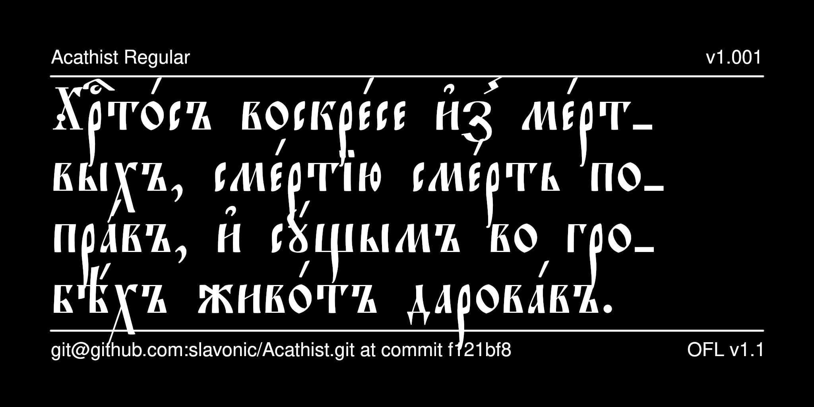

# Acathist Typeface

Acathist is a contemporary Church Slavonic font that reproduces the typeface used in the Synodal editions of the second half of the 19th and early 20th centuries. This typeface was used for large format editions such as Altar Gospel Books and Acathists.



## History

The font was originally designed by Vlad Dorosh as Akathistos UCS for
the [Irmologion project](http://irmologion.ru/fonts.html#akathistos).
It was then released under the LaTeX Project Public License
as part of [CSLTeX](https://sites.google.com/site/csltex/).
Next, it was reencoded for Unicode by Aleksandr Andreev.
Additional glyphs and OT features were by Aleksandr Andreev
and Nikita Simmons and the font was released as Acathist
as part of the [Slavonic Computing Initiative](https://sci.ponomar.net/fonts.html), and under SIL OFL v. 1.1.

## License

This Font Software is licensed under the SIL Open Font License,
Version 1.1. This license is available with a FAQ at
[https://openfontlicense.org/](https://openfontlicense.org/).

## Building the Fonts

The font is built using fontmake and gftools post processing script. Tools are all python based, so it must be previously installed.

To install all the Python tools into a virtualenv, do the following:

From terminal:

```

cd your/local/project/directory

#once in the project folder create a virtual environment. 
This step has to be done just once, the first time:

python3 -m venv venv

#activate the virtual environment

source venv/bin/activate

#install the required dependencies

pip install -r requirements.txt

```

Then run the this command:

```
cd sources
gftools builder config.yaml
```

The fonts are supposed to build automatically in the repository 
using GitHub Actions, but this does not work correctly.

## Features

* Stylistic Set 1 (*ss01*) changes the hyphen symbol (-) to an 
underscore (_), which is the default hyphenation symbol used
in Synodal Church Slavonic. This can be used for software such
as LibreOffice that does not support changing the default
hyphenation character.

* Stylistic Alternatives (*salt*) are provided for the following
characters:
  - an alternative form of capital ot (U+0460)

See your software's documentation about how to access these glyphs.

## More Church Slavonic Fonts

See the [main repository](https://github.com/typiconman/fonts-cu/issues) and the [website](https://sci.ponomar.net/fonts.html).
